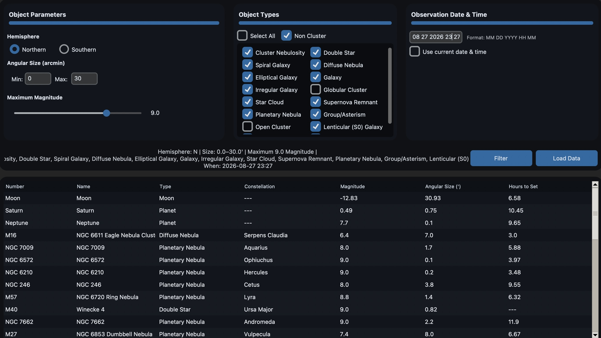
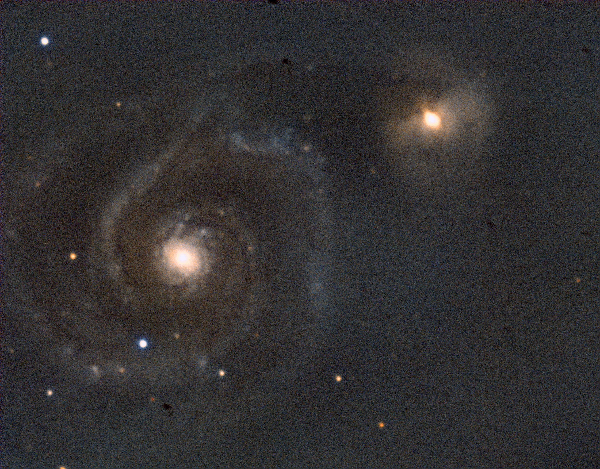
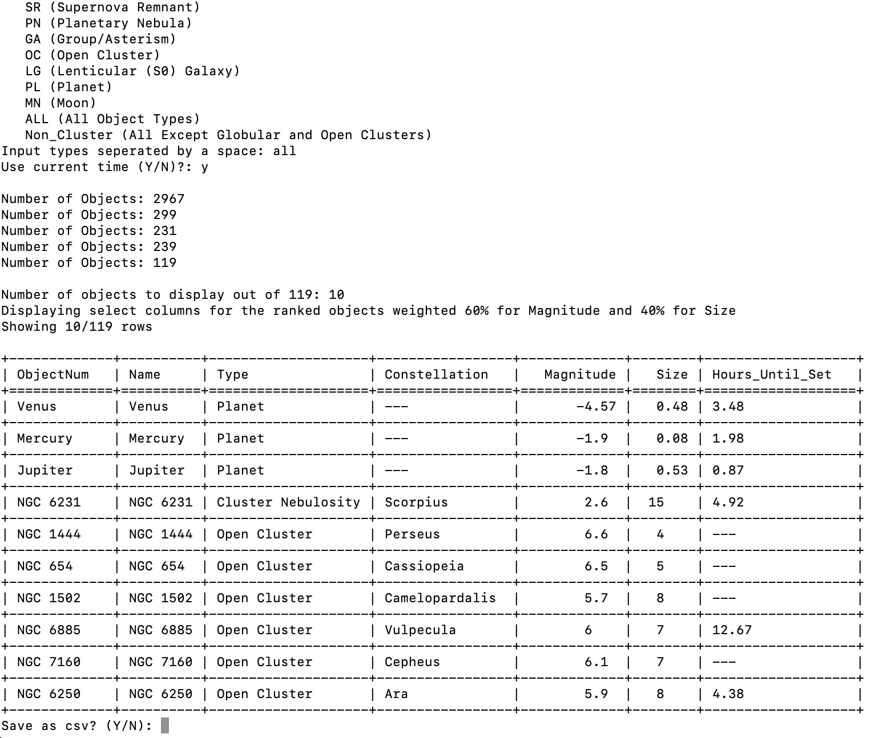
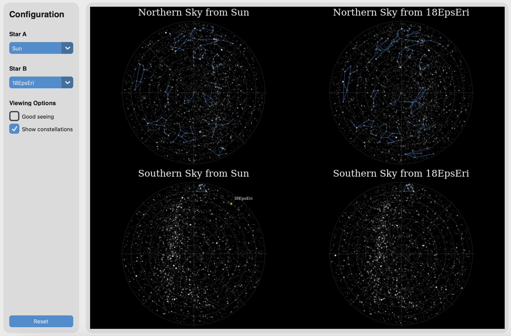

# AstroVisTools

 A collection of visualizers and simple programs that can be used for stargazing planning or exploring phenomena. More small astronomy related projects may be added in the future.

 ## Deep Sky Object Sort

 DSO Sort (*Figure 1*) is a simple tool allowing the user to plan astronomical observing with a telescope or naked eye. It was built to suit my needs, ranking objects according to a customized weighted sum of z-scores (number of standard deviations from the mean) of the apparent magnitude of objects and their angular size. The purpose of this is to maximize the brightness and minimize the size of the object to observe the highest intensity of light. The Dearborn Observatory telescope, the instrument I use most, has a focal ratio of ~15, meaning it has a narrow field of view and gathers light from diffuse sources far less efficiently than most other instruments. As a result, when planning observations for astrophotography (and eyepiece viewing to a lesser extent), we tend to prioritize small bright deep sky objects like planetary nebulae. 
 
 Many of the brightest objects in the night sky appear quite large in the sky, so the need to easily filter through targets that would not be observable was what inspired this project. *Figure 2* shows the Whirlpool Galaxy (M51) extending nearly the full FOV, around 10 arcminutes. The data for the tool comes from various Messier objects alongside the full NGC catalog and solar system objects. It's first filtered according to the user's specifications with `Filter` before the Stellarium API is called to present data according to their position in the sky and other time-dependent data with `Load Data`. The objects are then sorted and presented in tabular form. The original command line interface shown in *Figure 3* was designed and programmed manually with the later addition of a Graphical User Interface using TKinter assisted by AI. 

<figure>
  
  <figcaption>Figure 1: DSO Sort GUI example.</figcaption>
</figure>

<table>
  <tr>
    <td width='50%'>
      <figure>
        
        <figcaption>Figure 2: Whirlpool Galaxy Imaged through Dearborn Telescope.</figcaption>
      </figure>
    </td>
    <td width='50%'>
      <figure>
        
        <figcaption>Figure 3: Command line interface example.</figcaption>
      </figure>
    </td>
  </tr>
</table>

## Star Perspective Visualization

This tool was created as more of a curiosity than to serve any major utility. It allows the user to visualize our night sky from the perspective of nearby stars to see how the stars and constellations warp. This is done by representing all nearby objects in terms of equatorial coordinates and distances. They are visualized with respect to the sun, matching our northern and southern hemisphere skies. I then performed the painstaking task of manually connecting major individual constellations star by star until they could be shown. Certainly easier ways to do this exist, but those were not done and most of the southern hemisphere is without constellation lines.

Star positions are translated in cartesian coordinates then reverted back to angular coordinates, with new apparent magnitudes calculated. Finally, the stars are plotted alongside either the sun or any other star. The example in *Figure 4* shows the stars in our night sky as seen from Epsilon Eridani, a nearby star only 10.5 light years away. You can clearly see distortions in the constellations, leading one to wonder what other symbols and myths an alien civilization might see in their sky. Like DSO Sort, the GUI implementation is adapted from the attached notebook.

 <figure>
  
  <figcaption>Figure 4: Star Perspective Visualization example.</figcaption>
</figure>


## Running It

Clone the repository.
```bash
   git clone https://github.com/sfnwscott/AstroVisTools
   cd AstroVisTools
```

Create and activate a virtual environment.
```bash
   python -m venv venv
   source venv/bin/activate
```

Install the required dependencies.
```bash
   pip install -r requirements.txt
```